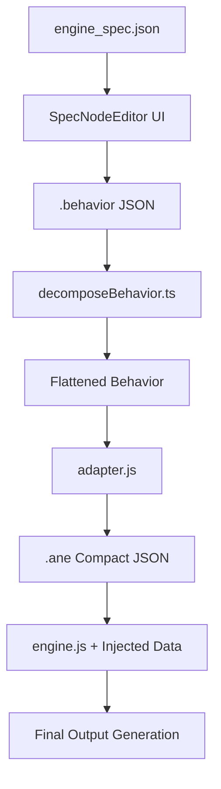

# Armillaris: Behavior Nodes Technical Guide

This document provides a comprehensive technical overview of the **Behavior Node System**. It covers the entire pipeline from node definition in the UI to logic execution in the engine.

---

## 1. General Philosophy: Generalization & Engine Independence
A core principle of the Behavior Node System is that the **Node Editor should remain engine-agnostic**. The editor itself does not have intrinsic knowledge of specific behavior nodes (like `Keyword Filter` or `List Filter`). Instead:
- **Node Definitions**: Nodes are defined entirely within the `engine_spec.json`.
- **Logic Execution**: Execution is handled by the `engine.js` (or a remote engine).
- **Generalized App-Side Changes**: If a feature requires the editor to react to node state (e.g., changing port types based on properties), it must be implemented as a **generalized mechanism** in the editor that any node can leverage via its specification.

> [!IMPORTANT]
> Avoid hardcoding node-specific logic in the editor (e.g., checking `if (node.label === 'List Filter')`). Instead, extend the `engine_spec` format to describe the desired behavior and update the editor to interpret that spec generically.

---

## 2. System Overview
The Behavior Node System allows users to design complex character behaviors using a visual graph. This graph is translated into a compact format that can be executed by the logic engine.



### Key Components
- **`engine_spec.json`**: Definition file for all nodes (ports, properties, categories).
- **`SpecNodeEditor.tsx`**: React Flow-based graph editor.
- **`specTraversals.ts`**: Handles graph flattening and "System Node" removal.
- **`adapter.js`**: Converts UI-friendly JSON to high-performance engine format.
- **`engine.js`**: Recursive, memoized execution engine.

---

## 2. Node Definition (`engine_spec.json`)

All nodes must be defined here to appear in the **Node Palette**.

### Schema Structure
- **`type`**: The functional type (used for logic branching in `engine.js`).
- **`label`**: The display name in the UI.
- **`category`**: Groups nodes in the palette (Input, Filter, Utility, etc.).
- **`inputs` / `outputs`**: Defined with `id`, `label`, and `type` (used for connection validation).
- **`properties`**: UI fields (select, string, number, boolean) stored in the node's `values` object.

> [!NOTE]
> Expandable properties (e.g., dynamic lists) use `$for` templates within the JSON.

---

## 3. Data Types

The system uses several core data types for ports and properties.

### Primitive & List Types
- **`String` / `Number` / `Boolean` / `Date`**: Standard primitive types.
- **`Value`**: A generic union of `String`, `Number`, `Boolean`, or `Date`.
- **`String List` / `Value List`**: Arrays of the corresponding types.

### Domain Objects
- **`Entry`**: A lore entity. Contains an `id`, `label`, and a dictionary of properties (attributes).
- **`Entry List`**: An array of `Entry` objects.
- **`Attribute`**: A representation of a single property on an entry. Contains a `name` and a `Value`.
- **`Message`**: A chat message. Contains `message` (string), `is_bot` (boolean), and `date`.
- **`Message List`**: An array of `Message` objects (chat history).

## 4. UI & Graph Storage

Behavior graphs are saved as `.behavior` files. They contain:
- **`nodes`**: React Flow nodes with positions and `data.values`.
- **`edges`**: Standard React Flow connection data.
- **Nested Graphs**: `Group` nodes store a sub-graph in `node.data.graph`.

---

## 5. Graph Flattening (`decomposeBehavior.ts`)

Before execution, the hierarchical graph must be converted into a flat structure that the engine understands.

### System Nodes
"System Nodes" are used for UI organization but have no engine logic:
- **`Group`**: A container for sub-graphs.
- **`GroupInput` / `GroupOutput`**: Proxy ports to bridge connections into/out of groups.

### Decomposition Process
1. **Hierarchical ID generation**: Every node gets a prefix based on its depth (e.g., `GroupA.GroupB.Node1`).
2. **Proxy Filtering**: `Group`, `GroupInput`, and `GroupOutput` nodes are removed.
3. **Edge Synthesis**: The decomposer walks "segments" across proxy nodes to create direct edges between functional nodes.

---

## 6. Adaptation & Injection

### `adapter.js`
The `adapt()` function transforms the flattened JSON into **Armillaris Native Engine (.ane)** format:
- **String Table**: All strings are indexed to reduce size.
- **Compact Nodes**: `[TypeIdx, [PropKeyIdx, PropVal, ...]]`.
- **Compact Edges**: `[SrcIdx, SrcPortIdx, TgtIdx, TgtPortIdx]`.

3. Optionally minified result with `terser`.

### Property Resolution Whitelist (`isStringKey`)
When `adapt()` converts the graph, it indexes all strings into a table to save space. Inside the engine, the `getProps` function uses a whitelist called `isStringKey` to determine which property values should be resolved from the index back into their original strings.

> [!CAUTION]
> If you add a new node with a property that stores a string (e.g., `regex`, `operator`, `sort_by`), you **must** add that property name to the `isStringKey` array in both `engine.js` and `dev_engine.js`. Otherwise, the logic will receive a numeric index (like `42`) instead of the actual string value.

---

## 7. Execution Model (`engine.js`)

The engine is **pull-based** and **recursive**.

### Memoization
- Results are cached in `memo[nodeIdx:portIdx]`.
- Nodes are only executed once per run, regardless of how many connections they have.

### The recursive "Pull"
1. Execution starts at the `OutputRoot` (or `ActivationOutput`) node.
2. It calls `resolveInput(port)` -> `executeNode(sourceNode)`.
3. This propagates back to `InputSource` nodes.

### Multi-output Nodes
If a node has multiple output ports, `engine.js` receives the requested `portName`. You must use a conditional check to return the corresponding data:
```javascript
if (portName === "matches") result = matches;
else if (portName === "start_positions") result = starts;
else result = matches; // Default fallback
```

### Type vs Label Dispatching
The `switch(type)` in `engine.js` routes based on the `type` field in `engine_spec.json`.
- **Generic Type**: If multiple nodes share a `type` (e.g., `Filter`), use the `label` or properties to branch logic.
- **Unique Type**: If a node has a unique `type` (e.g., `StringRegex`), you can add a dedicated `case` to the switch.

### Dynamic Typing via Spec-Driven Transformations
Nodes can define reactive type transformations in `engine_spec.json`. This allows port types (and handle styles) to change based on node properties without app-side hardcoding.

#### Spec Definition
Add `typeTransformation` to a `PortDef`:
```json
{
    "id": "list_output",
    "type": "List",
    "typeTransformation": {
        "type": "de-list",
        "property_trigger": "return_single"
    }
}
```
- **Supported Types**: `de-list` (removes " List" suffix), `replace` (requires `target_type`).
- **Trigger**: `property_trigger` (boolean property) or `property_conditions` (map of property IDs to exact values).

#### System Architecture
- **Inference**: `specTypeInference.ts` uses `applyTypeTransformation` to resolve the final port type for validation and handle styles.
- **Reactive UI**: `useNodeLogic.ts` ensures labels and styles update immediately when the trigger property changes.

---

---

## 8. Simulating & Debugging

The Behavior Editor provides real-time feedback by executing a simulation engine whenever the graph or lore data changes.

### Development vs. Production Engines
- **`dev_engine.js`**: Used by the editor for simulation. It includes instrumentation to record the state of every port during execution.
- **`engine.js`**: The production-ready engine. It is stripped of all debugging code to maximize performance and minimize memory usage.

> [!NOTE]
> Functionally, both engines must be identical. When adding a new node, its implementation must be added to both files.

### The Debugging Mechanism
The simulation engine populates two key global variables that are extracted by the Electron host:
- **`debug_nodes`**: An array of UUIDs for all nodes that were reached during the recursive "pull" execution.
- **`debug_ports`**: A hierarchical object `{ nodeUuid: { portId: value } }` containing the result of every port execution.

### Tooltip Resolution
When you hover over or click a port in the editor, the app uses `usePortHoverDebug.ts` to:
1. Identify the port and its node.
2. Trace backward through connections to find the **source functional node** (resolving groups and proxy ports).
3. Look up the runtime value from `debug_ports` using the source node's UUID.
4. Display the value in a `JsonTree` viewer.

---

## 9. Node Logic Traces

### Keyword Filter
1. **Inputs**: `entries`, `messages`.
2. **Properties**: `case_sensitive`, `wordbreak_sensitive`, `match_limit`, `message_user_type`.
3. **Logic**:
   - Loops through each entry.
   - Extracts keywords (from `entry.Keywords`).
   - Creates a Regex based on sensitive flags.
   - Tests the regex against the message history (filtered by sender type).
   - If any keyword matches, the entry is added to the output list.

### Sort Entries By Attribute
1. **Inputs**: `entries`, `attribute_name`.
2. **Properties**: `attribute_name`.
3. **Logic**:
   - Resolves the attribute name from either the input port or the static property.
   - Creates a shallow copy of the entry list.
   - Sorts the list using a custom comparator.
   - For each comparison, it extracts the property value from the entries' attributes.
   - Returns the sorted (or inverse sorted) list.

### Join List
1. **Inputs**: Multiple `list_n` inputs (dynamic).
2. **Properties**: `deduplicate` (off, first, last).
3. **Logic**:
   - Gathers all incoming edges.
   - Recursively executes source nodes for each edge.
   - Concatenates all results into a single array.
   - Applies deduplication by item ID or value if requested.

---

## 10. How to add a New Node

1. **Define Schema**: Add the node to `engine_spec.json` with appropriate ports and properties.
2. **Implement Logic**: Add a new `case` in the `executeNode` switch statement in BOTH `engine.js` and `dev_engine.js`.
3. **Update Adapter (If needed)**: If your node introduces new data types or specific property mapping needs, update `getProps` in the engines or `adapt` in `adapter.js`.
4. **Validation**: Test the node in the `SpecNodeEditor` and verify output in the `Activation` panel. Verify that the debug tooltip shows correct data.

---

## 11. Critical Lessons & Debugging Gotchas

Recent debugging has revealed several "gotchas" that are critical for system maintainers:

### The "Broken Pull Chain" Phenomenon
Because the engine is **pull-based** (execution starts at the output and works backward), if a node in the chain fails to explicitly call `resolveInput()` for a connected port, the **upstream nodes will never execute**.
- **The symptom**: A port shows "Data not available" even though it is clearly connected.
- **The cause**: A downstream node has a logic error (e.g., a `switch` case mismatch) that prevents it from pulling data from that port.
- **The solution**: Check the `switch` cases in `engine.js` for the immediate downstream nodes to ensure they are correctly identifying their type and calling `resolveInput`.

### Debug Data Extraction
The Electron host (`engines.ts`) extracts debug data by looking for specific variable names in the JavaScript sandbox.
- **Requirement**: In `dev_engine.js`, ensure that `_debug_nodes` and `_debug_ports` (prefixed with underscores for the host) are explicitly assigned at the very end of the script:
  ```javascript
  var _debug_nodes = executed_uuids;
  var _debug_ports = debug_ports;
  ```

### Regex Support & Captures
The `String Regex` node handles both full matches and capturing groups.
- **Logic**: It flattens all capture groups into the `matches` list: `[FullMatch, Group1, Group2, ...]`.
- **Global Flag**: When the `global` property is enabled, the engine loops through all matches in the input string, appending each set of full-match + groups to the output list.
