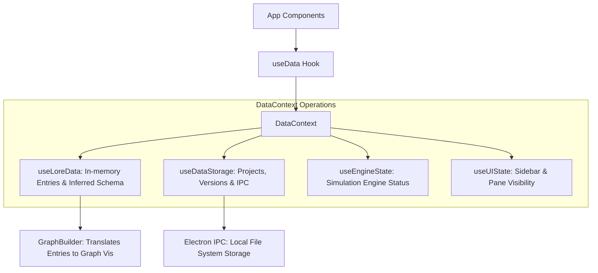

# Armillaris: Data Infrastructure Guide

This document provides a comprehensive overview of the **Data Infrastructure** in Armillaris, covering how lore entries are structured, managed, stored, and imported.

---

## 1. Core Data Model: `LoreEntry`

The fundamental unit of data in Armillaris is the `LoreEntry`. It represents a single entity in the lorebook (e.g., a character, a location, or an object).

### `LoreEntry` Structure
Defined in [src/lib/types.ts](file:///f:/Fun/Dev/armillaris/src/lib/types.ts):
- **`id`**: A unique identifier (UUID).
- **`label`**: The display name of the entry.
- **`sourceType`**: Tracks where the entry came from (`'notion'`, `'manual'`, etc.).
- **`sourceId`**: (Optional) The ID in the external source (e.g., Notion Page ID).
- **`properties`**: A flexible `Record<string, any>` dictionary containing the actual content.

### Reserved Properties
While the `properties` map is flexible, several keys have special meaning in the editor and engine:
- **`Meta`**: Used to categorize the entry and determine which schema definitions apply.
- **`Keywords`**: A list of strings used by the `Keyword Filter` node.
- **`Personality`**: Character-specific behavioral instructions.
- **`Scenario`**: Contextual information about the current situation.
- **`Example Dialogs`**: Formatting-sensitive conversation samples.

---

## 2. State Management: `DataContext`

The application uses a central React Context ([src/context/DataContext.tsx](file:///f:/Fun/Dev/armillaris/src/context/DataContext.tsx)) to manage all data-related states.

### Data Flow Architecture
The `DataProvider` orchestrates several specialized hooks to separate concerns:

### Key Context Provided
- **`entries`**: The current list of lore entries being edited.
- **`metaDefinitions`**: The schema inferenced from the current entries.
- **`graphData`**: A visual representation of entry relationships for the Graph View.
- **Selection State**: Tracks the currently selected entry and active tabs/panes.

---

## 3. Schema System: Meta Definitions

Armillaris uses a "schema-on-read" approach called **Meta Definitions**. Instead of requiring a rigid database migration, the editor infers the schema from the existing data.

### Inference Logic (`useLoreData.ts`)
The `inferMetaDefinitions` function scans all entries and groups them by their `Meta` property value.
1. It identifies all unique property keys used by entries in that group.
2. It determines the **Property Type**:
   - **`string`**: Standard text.
   - **`list`**: An array of values.
   - **`relation`**: An array of strings where every string matches an `id` of another entry in the dataset.

### Schema Display
The **Data Schema Pane** (inside `DataView`) displays these inferred definitions, allowing users to see what attributes are available for each category (Meta) of entries.

---

## 4. Persistence: Projects & Versioning

Data is persisted on the local file system via Electron's IPC bridge.

### Project Structure
- Each project is a folder containing a series of JSON files.
- Each file represents a **Version** (snapshot) of the lore data.

### `useDataStorage` Features
- **Autosave**: Throttled (5s) automatic saving of changes to the current project.
- **Manual Save**: Creates an explicit snapshot.
- **Version History**: Users can browse and revert to previous snapshots in the **Import Pane**.
- **Pruning/Compression**: Automated tools to clean up old or redundant snapshots to save space.

---

## 5. Import Mechanisms

Armillaris supports importing data from multiple sources via the **Import Manager** pane.

### Notion Integration
Users can sync data directly from Notion databases using `NotionSource.ts`.
- Requires an **Integration Token** and **Database IDs**.
- Maps Notion properties to the `LoreEntry` format.
- Supports Two-Way Relations in Notion, which are converted to `relation` types in Armillaris.

### Asset Imports
The Import Manager also handles non-lore data types:
- **.behavior Files**: Direct import of node graph logic.
- **Module Zips**: Installation of packaged lorebook assets.
- **Engine Zips**: Addition of new script engine templates.

### Tutorial Data
A dedicated `loadTutorialData` function in `DataContext` can populate the workspace with a predefined set of entries from `tutorialData.ts`, useful for onboarding.

---

## 6. UI: `DataView`

The `DataView` component provides the primary interface for interacting with lore data.

- **DataListPane**: Sorting, filtering by Meta, and searching entries.
- **DataEditorPane**: Form-based editing of properties.
- **DataManagerPane**: Managing projects, versions, and backup operations.
- **DataSchemaPane**: Inspected view of the inferred data structure.
